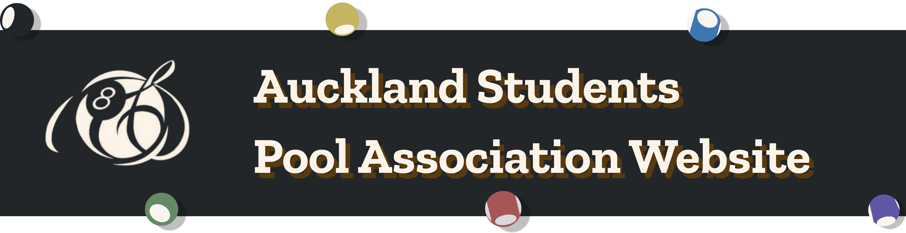

## What is ASPA 🎱?

The **Auckland Student Pool Association (ASPA)** is centered at the University of Auckland, dedicated to fostering a vibrant community united by a love for pool. Their mission is to cultivate an inclusive atmosphere that encourages camaraderie and skill development among billiards enthusiasts. Through a variety of casual gatherings, coaching sessions, and spirited tournaments, they aim to connect members eager to engage in both competitive and social play.

## Overview

This project aims to develop a fully fledged website that provides a space for members to learn more about **ASPA’s** mission, events, and initiatives, while also offering useful tools for participation. The core functionality of the site includes a reusable and scalable **ticketing system** designed for use in **ASPA** and future **WDCC** projects. Additionally, the platform will feature an integrated **ELO ranking system** to support interactive and competitive elements, helping to foster engagement within the community.
### Disclaimers ⚠️: 
At this time, we are only accepting contributions from members of the ASPA team. This is to ensure alignment with internal goals, standards, and workflows. 
We appreciate your understanding and interest in our work. If you have questions or suggestions, feel free to open an issue for discussion.

## Project Setup 

This project uses **React (TypeScript)** for the frontend, **PostgreSQL** for the database, and **Docker** to manage services. You can run it either using GitHub Codespaces or locally with Docker.

### 🧑‍💻 Option 1: Using GitHub Codespaces 
GitHub Codespaces provides a pre-configured dev environment. You can set up a new GitHub Codespace within the repository. When working on a new feature or bug fix, make sure to create a separate branch off of the `main` branch before starting your work.

**Steps:**
1. Click the green **Code** button and click the three dots **(...)** next to the plus **(+)**
2. Codespaces will auto-build your dev container
3. GitHub will automatically launch the project in a pre-configured dev container with all necessary tools installed.
4. Once the Codespace starts, the project will open in a web-based VS Code environment where you can view, edit, and run the code just like in the desktop version of VS Code

### 🏗️ Option 2: Local Development
If you're not using Codespaces and prefer to develop locally:

**Pre-requisites:**

Please see the **Wiki** page, [Getting Started](https://github.com/UoaWDCC/aspa-portal-v3/wiki/GettingStarted) for the pre-requisites and follow the instructions to install the necessary pre-requisites tools.

**Local Development:**

After installing the necessary pre-requisites tools, follow the steps below to set up the dev container:

**Steps:**
1. Clone the repository
    - Note: If you are using **Windows** you need to clone to WSL2 home/{username} directory for the dev container to be fully functional (Refer to Windows Docker Desktop Section of [Getting Started](https://github.com/UoaWDCC/aspa-portal-v3/wiki/GettingStarted))
2. Open the repository in Visual Studio Code
3. Press `F1` and select `Dev Container: Open Folder in Container`
4. Select the root folder of the repository
5. Select the dev container `ASPA Dev Container (Full)`
6. Wait for the dev container to build (this may take a while)

Now you have a development environment set up with all the necessary tools and dependencies installed :)

## Development Tools 🛠️

This project uses the following tools to support development:

### Yarn - Setup and Usage

Yarn is a JavaScript package manager, like npm. It's used to install project dependencies (like React, TypeScript, etc.). Yarn is already installed inside the development environment, whether you're using **GitHub Codespaces** or running the **Dev Container locally** in VS Code. No need to install it yourself, just run commands from the terminal.

Run the app:

```bash
yarn dev
```

### Storybook - Setup and Usage

Storybook is a tool for building and testing UI components in isolation. Again, all Storybook dependencies are pre-installed in the dev container, so you only need to know how to run and test it.

Start Storybook:

```bash
yarn storybook
```

Run Tests:

```bash
yarn test
```

## Contributors ~ 2025

| Name             | Role               |
|------------------|--------------------|
| Yoyo Chen        | Project Manager    |
| Gurjot Bhullar   | Tech Lead          |
| Abdul Amidu      | Developer          |
| Henry Ly         | Developer          |
| Eugene Lee       | Developer          |
| John Sarte       | Developer          |
| Nathan Crasto    | Developer          |
| Olivia Kusuma    | Developer          |
| Owen Sugden      | Developer          |
| Tim Sinyakov     | Developer          |
| Youdao Xing      | Developer          | 